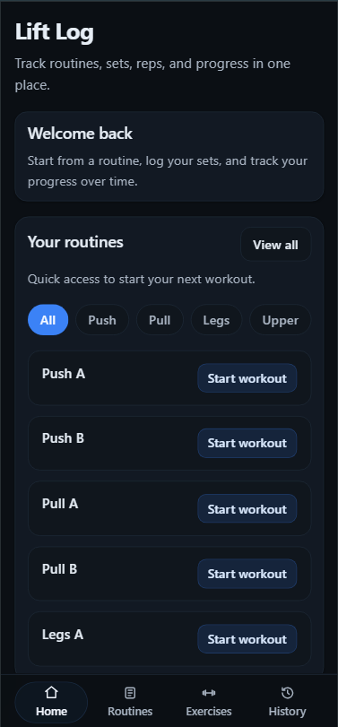
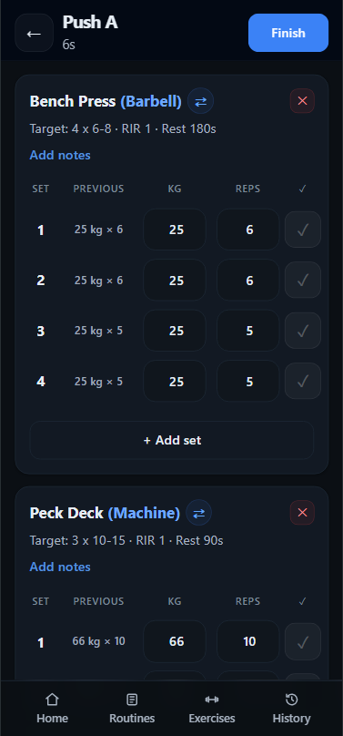
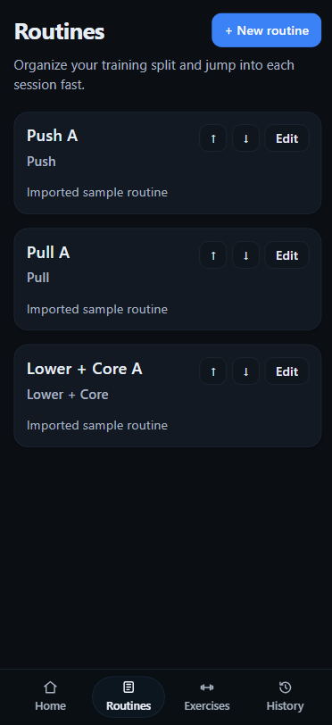
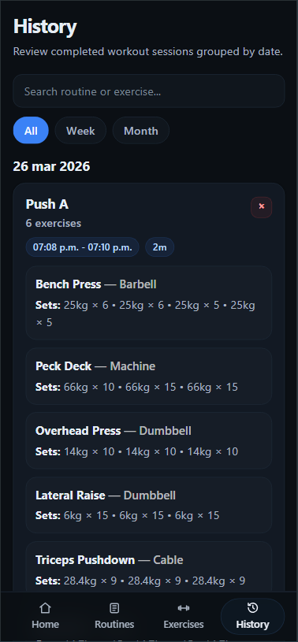
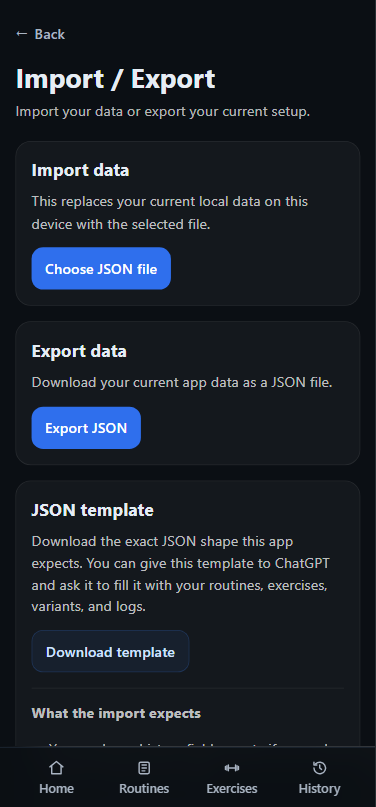

# Lift Log

A mobile-first workout tracker built with React, TypeScript, Zustand, and Vite.

Lift Log helps users manage exercises, exercise variants, and routines, run active workout sessions, review session history, and back up data through JSON import/export. The app is designed with a clean dark-mode interface and is installable as a Progressive Web App (PWA).

## Features

- Mobile-first responsive UI
- Dark-mode interface with blue accent styling
- Routine management
- Exercise and exercise variant management
- Active workout session flow
- Session-based workout history
- Prefilled latest performance in active sessions
- Variant swap during active workouts
- Create new variants directly from an active session
- Weight unit toggle (kg / lb)
- JSON import / export
- Downloadable JSON template
- Installable PWA support

## Screenshots

### Home

### Active Workout

### Routines

### History

### Import / Export

## Tech Stack

- React
- TypeScript
- Vite
- React Router
- Zustand
- CSS
- vite-plugin-pwa
- Vercel

## Highlights

- Refactored the app from a legacy workout log model into a session-based workout architecture
- Preserved backward compatibility for legacy JSON imports through migration into workout sessions
- Implemented local-first persistence with JSON backup and restore support
- Designed around real gym usage, including in-session variant swapping and prefilled latest performance

## Getting Started

### 1. Install dependencies

npm install

### 2. Start the development server

npm run dev

### 3. Build for production

npm run build

### 4. Preview the production build

npm run preview

## Project Structure

src/
app/
components/
pages/
store/
styles/
utils/
public/
docs/
screenshots/

## Data Storage

Lift Log currently stores data locally in the browser on the current device.

To reduce the risk of losing data, the app includes built-in JSON export and import features so users can create backups and restore them later.

## PWA

Lift Log is configured as a Progressive Web App.

It includes:

- Web app manifest
- Service worker
- Installable experience on supported devices
- Offline-ready app shell

## Available Scripts

- npm run dev — start the local development server
- npm run build — type-check and build for production
- npm run preview — preview the production build locally
- npm run lint — run ESLint

## Deployment

This project is deployed with Vercel.

## Current Status

Lift Log is currently a local-first app with session-based workout tracking, persistent local storage, and JSON import/export for backups.

Authentication, cloud sync, and database persistence may be added in a future iteration.
